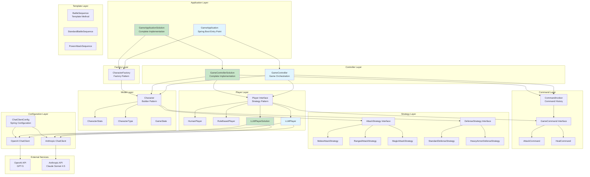
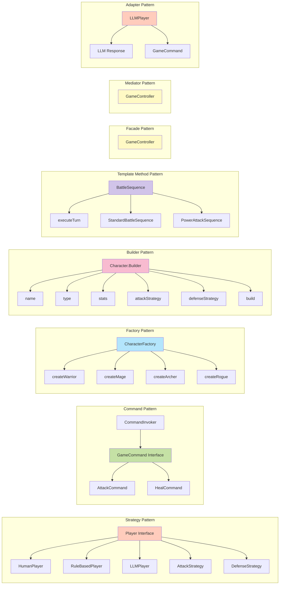
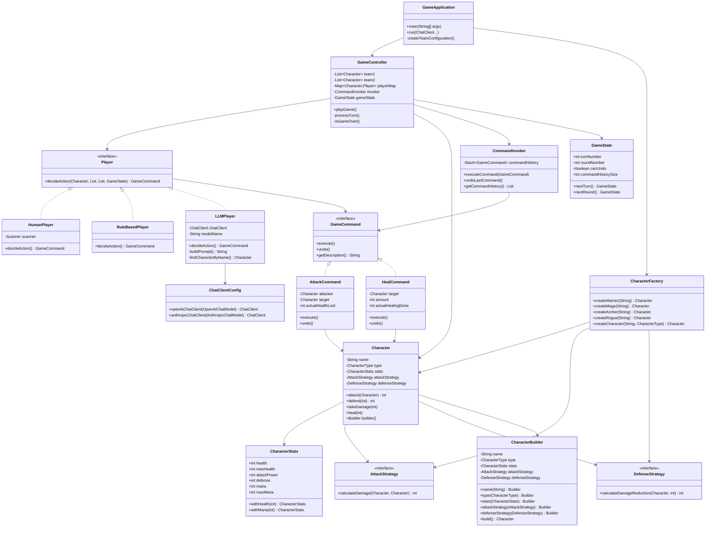
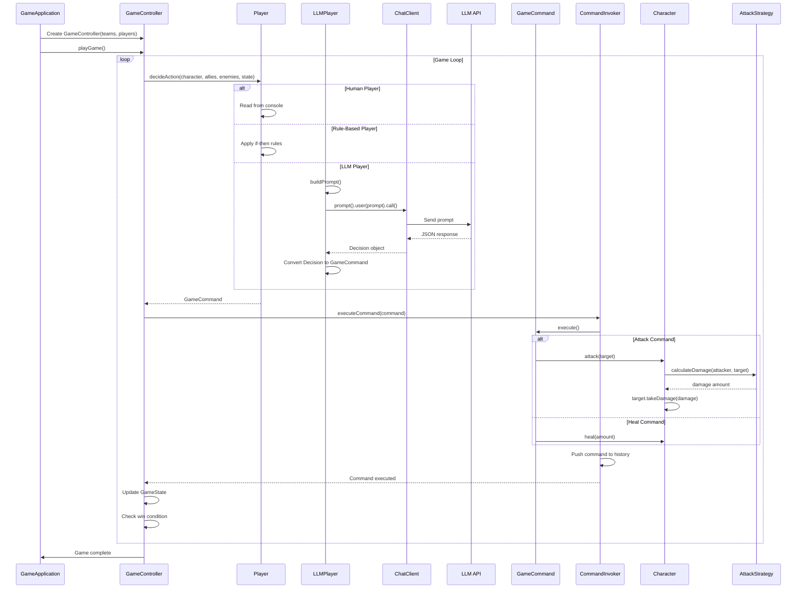
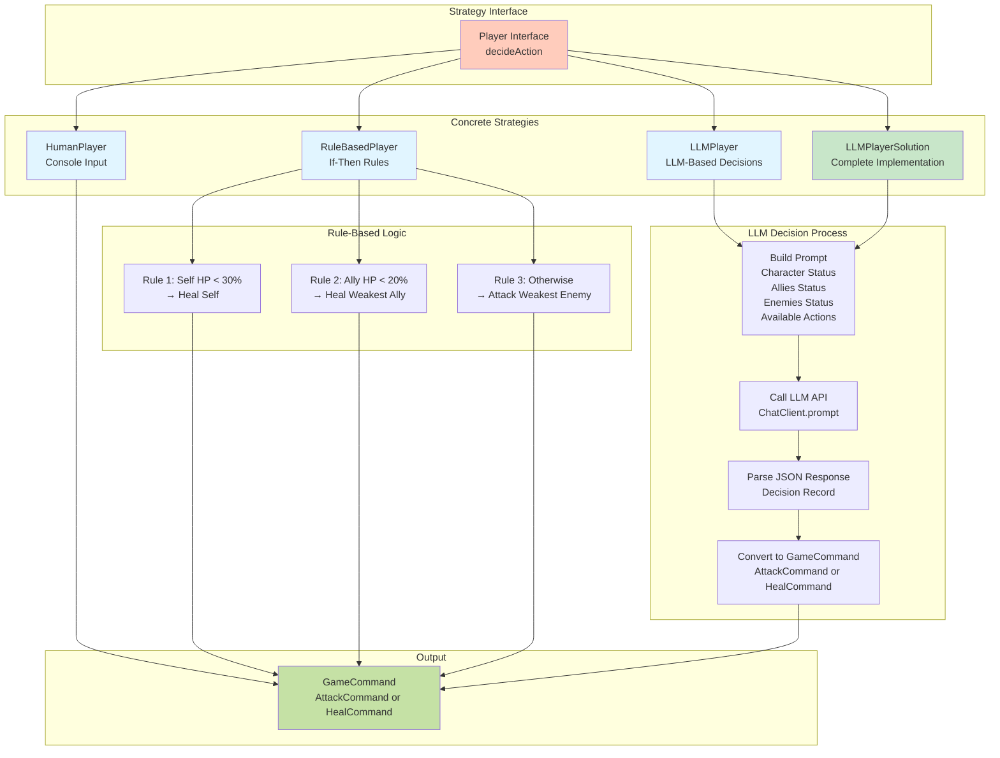
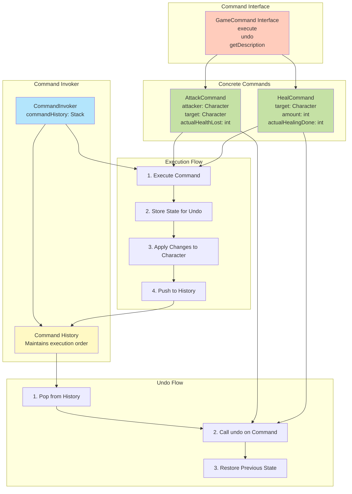
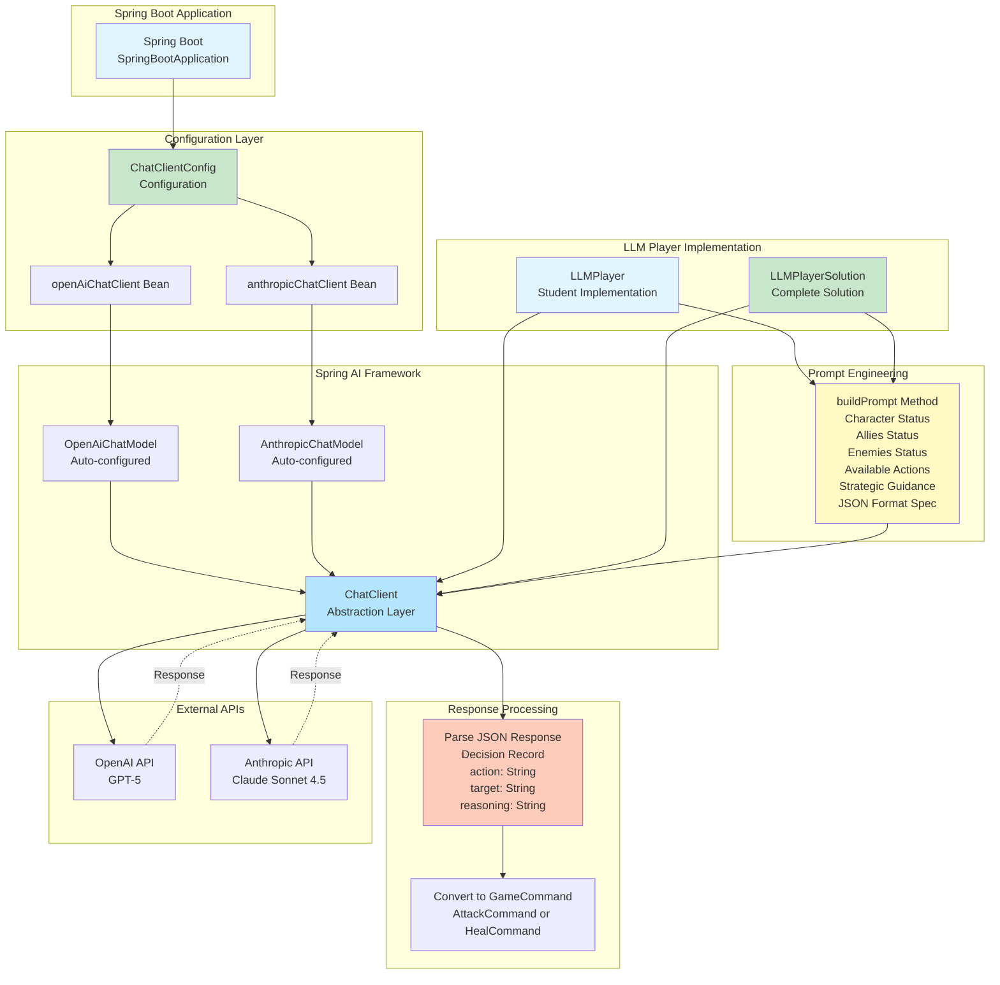
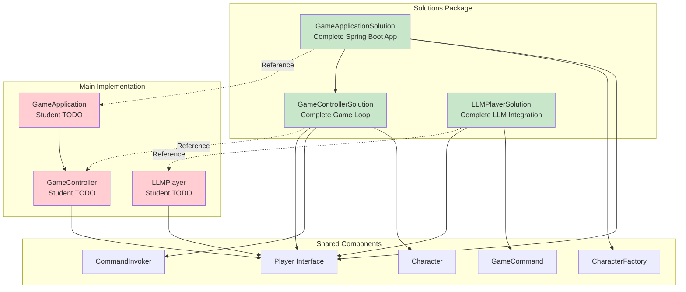
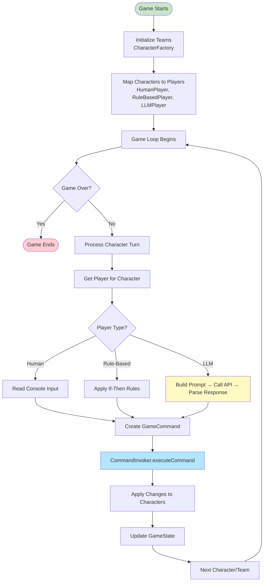

# Architecture Diagrams

This document provides comprehensive architecture diagrams for the AI-Powered RPG Game project, including both the main implementation and solutions folder.

## Table of Contents
1. [High-Level System Architecture](#high-level-system-architecture)
2. [Design Patterns Overview](#design-patterns-overview)
3. [Class Relationships Diagram](#class-relationships-diagram)
4. [Component Interaction Flow](#component-interaction-flow)
5. [Player Strategy Pattern Detail](#player-strategy-pattern-detail)
6. [Command Pattern Detail](#command-pattern-detail)
7. [Spring AI Integration](#spring-ai-integration)

---

## High-Level System Architecture



---

## Design Patterns Overview



---

## Class Relationships Diagram



---

## Component Interaction Flow



---

## Player Strategy Pattern Detail



---

## Command Pattern Detail



---

## Spring AI Integration



---

## Solutions Folder Architecture



---

## Data Flow Diagram



---

## Package Structure

```
edu.trincoll.game
├── GameApplication.java (Main Entry Point)
├── builder/ (Builder Pattern - if implemented)
├── command/
│   ├── GameCommand.java (Interface)
│   ├── AttackCommand.java
│   ├── HealCommand.java
│   └── CommandInvoker.java
├── config/
│   └── ChatClientConfig.java (Spring Configuration)
├── controller/
│   └── GameController.java (Game Orchestration)
├── factory/
│   └── CharacterFactory.java (Factory Pattern)
├── model/
│   ├── Character.java (Builder Pattern)
│   ├── CharacterStats.java (Immutable Record)
│   └── CharacterType.java (Enum)
├── player/
│   ├── Player.java (Strategy Interface)
│   ├── HumanPlayer.java
│   ├── RuleBasedPlayer.java
│   ├── LLMPlayer.java
│   └── GameState.java (Immutable Record)
├── strategy/
│   ├── AttackStrategy.java (Functional Interface)
│   ├── DefenseStrategy.java (Functional Interface)
│   ├── MeleeAttackStrategy.java
│   ├── RangedAttackStrategy.java
│   ├── MagicAttackStrategy.java
│   ├── StandardDefenseStrategy.java
│   └── HeavyArmorDefenseStrategy.java
└── template/
    ├── BattleSequence.java (Template Method)
    ├── StandardBattleSequence.java
    └── PowerAttackSequence.java

edu.trincoll.solutions
├── GameApplicationSolution.java
├── GameControllerSolution.java
└── LLMPlayerSolution.java
```

---

## Design Patterns Summary

| Pattern | Location | Purpose |
|---------|----------|---------|
| **Strategy** | `player/Player.java` | Different decision-making algorithms (Human, Rule-based, LLM) |
| **Strategy** | `strategy/AttackStrategy.java` | Different attack calculation methods |
| **Strategy** | `strategy/DefenseStrategy.java` | Different defense calculation methods |
| **Command** | `command/GameCommand.java` | Encapsulate actions as objects, support undo |
| **Factory** | `factory/CharacterFactory.java` | Create pre-configured characters |
| **Builder** | `model/Character.Builder` | Construct complex Character objects |
| **Template Method** | `template/BattleSequence.java` | Define battle sequence skeleton |
| **Facade** | `controller/GameController.java` | Simplify complex game loop |
| **Mediator** | `controller/GameController.java` | Coordinate between components |
| **Adapter** | `player/LLMPlayer.java` | Adapt LLM responses to GameCommands |

---

## Notes

- **Main Implementation**: Files in `edu.trincoll.game` contain TODOs for students to implement
- **Solutions**: Files in `edu.trincoll.solutions` contain complete reference implementations
- **Spring AI**: Integration uses Spring AI's ChatClient abstraction for multiple LLM providers
- **Immutability**: `CharacterStats` and `GameState` use Java records for immutability
- **Functional Interfaces**: Strategy interfaces are functional, allowing lambda implementations

